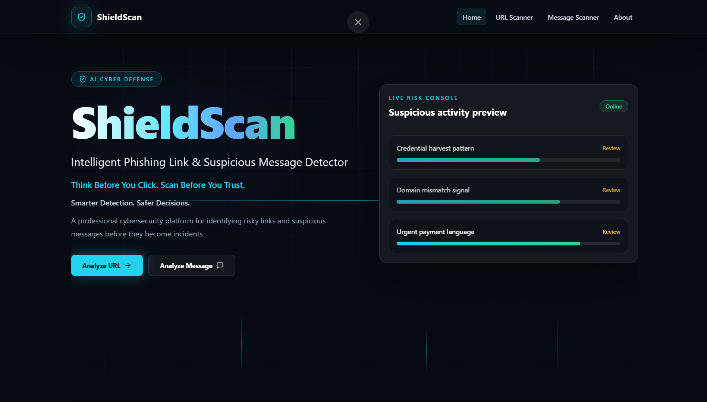
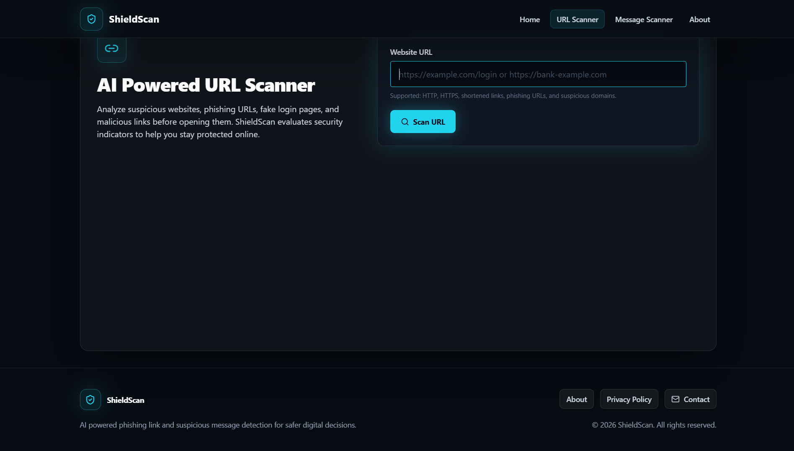
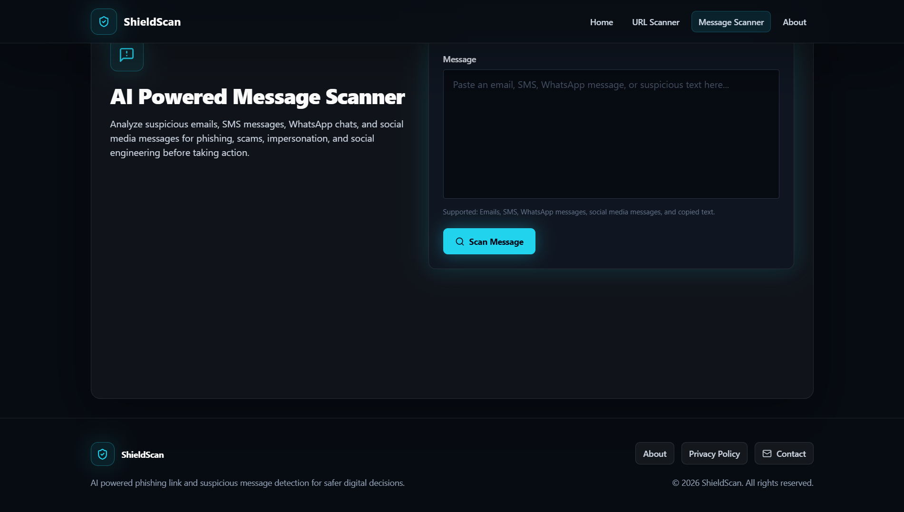
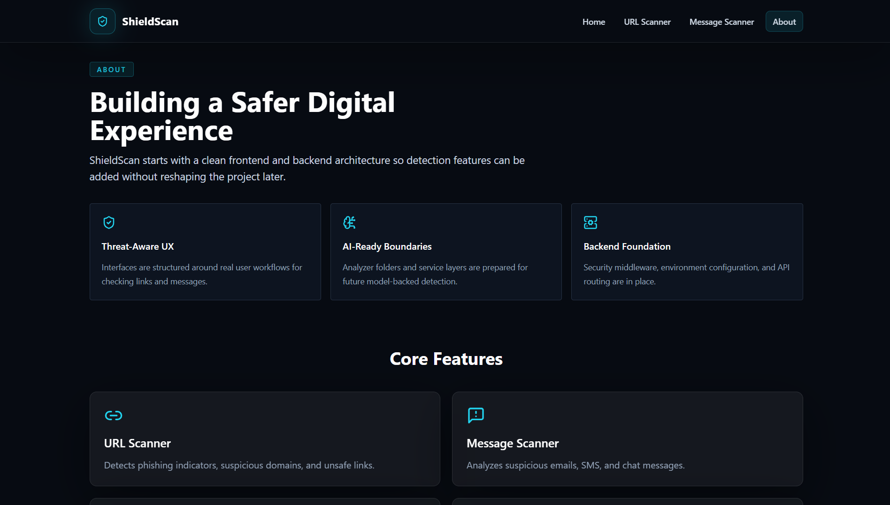

# 🛡 ShieldScan

<div align="center">

### AI Powered Phishing URL & Suspicious Message Detection Platform


AI-powered cybersecurity web application that helps users detect phishing URLs and suspicious messages using an intelligent rule-based detection engine with an AI-ready architecture.

### 🌐 Live Demo

**Website:** https://shield-scan-client.vercel.app

**GitHub Repository:** https://github.com/CodewithRP25/ShieldScan

</div>

---

# 📖 Overview

Cyber threats such as phishing websites, fake login pages, scam messages, and social engineering attacks are increasing every day. Many users unknowingly click malicious links or respond to fraudulent messages, resulting in financial loss and compromised personal information.

**ShieldScan** is designed to provide a simple, fast, and user-friendly platform where users can analyze suspicious URLs and messages before interacting with them. The system uses a rule-based phishing detection engine while maintaining an architecture that is ready for future AI integration.

---

# ✨ Features

### 🔗 URL Scanner

* Detects suspicious URLs
* Identifies phishing indicators
* Checks insecure HTTP links
* Detects URL shorteners
* Detects suspicious keywords
* Detects suspicious domain extensions
* Detects IP-based URLs
* Provides confidence score
* Provides safety score
* Gives security recommendations

---

### 💬 Message Scanner

* Analyzes Emails
* Analyzes SMS
* Analyzes WhatsApp messages
* Detects phishing keywords
* Detects urgency indicators
* Detects suspicious links
* Detects phone numbers
* Calculates risk score
* Provides confidence score
* Gives safety recommendations

---

### 🛡 Additional Features

* Responsive UI
* Modern Cybersecurity Theme
* AI Ready Architecture
* Rule-Based Detection Engine
* Real-Time Scan Results
* Detailed Detection Reasons
* Live Threat Meter
* Safety Score Visualization
* Production Ready Deployment

---

# 🛠 Tech Stack

## Frontend

* React 19
* Vite
* Tailwind CSS
* Framer Motion
* React Router DOM
* Axios
* Lucide React

## Backend

* Node.js
* Express.js
* CORS
* Helmet
* Morgan
* dotenv

## Deployment

* Vercel (Frontend)
* Render (Backend)
* GitHub (Version Control)

---

# 📂 Project Structure

```text
ShieldScan/
│
├── client/
│   ├── src/
│   ├── public/
│   └── package.json
│
├── server/
│   ├── src/
│   ├── package.json
│   └── .env.example
│
├── docs/
│   └── screenshots/
│       ├── home.png
│       ├── url-scanner.png
│       ├── message-scanner.png
│       └── about.png
│
└── README.md
```

---

# ⚙ Installation

## Clone Repository

```bash
git clone https://github.com/CodewithRP25/ShieldScan.git
```

---

## Install Dependencies

```bash
npm install
```

or

```bash
npm run install:all
```

---

## Start Backend

```bash
cd server
npm install
npm run dev
```

---

## Start Frontend

```bash
cd client
npm install
npm run dev
```

---

Frontend runs on:

```text
http://localhost:5173
```

Backend runs on:

```text
http://localhost:5000
```

---

# 📡 API Endpoints

## Health Check

```http
GET /api/health
```

Returns server status.

---

## URL Scanner

```http
POST /api/analyze/url
```

Request

```json
{
  "url": "https://example.com"
}
```

---

## Message Scanner

```http
POST /api/analyze/message
```

Request

```json
{
  "message": "Congratulations! You won ₹1,00,000."
}
```

---

# 🌐 Live Deployment

## Frontend

https://shield-scan-client.vercel.app

## Backend

https://shieldscan-n5as.onrender.com

---

---

# 🖼 Application Screenshots

## 🏠 Home Page



---

## 🔗 URL Scanner



---

## 💬 Message Scanner



---

## ℹ️ About Page



---

# 🔮 Future Roadmap

The following features are planned for future releases:

* 🤖 AI-powered phishing explanation using Large Language Models (LLMs)
* 🌐 VirusTotal API integration
* 📊 Real-time threat intelligence feeds
* 📱 QR Code Scanner
* 🧾 Scan History Dashboard
* 🧩 Browser Extension
* 📈 Security Analytics Dashboard
* 👥 User Authentication & Personal Dashboard

---

# 👨‍💻 Developed By

**Ravi Patel**

Diploma in Computer Engineering

Government Polytechnic Vadnagar

---

# 🎯 Project Objectives

* Detect phishing URLs before users visit malicious websites.
* Analyze suspicious emails, SMS, and chat messages.
* Improve cybersecurity awareness.
* Provide simple and user-friendly phishing detection.
* Build an AI-ready cybersecurity platform.

---

# 📜 License

This project is developed for **educational and cybersecurity awareness purposes** as part of the **GTU Skill-Based Training Program (SBTP)**.

It is intended for learning, demonstration, and academic use.

---

# ⭐ Support

If you found this project useful, consider giving it a ⭐ on GitHub.

---

<div align="center">

### 🛡 ShieldScan

**Building a Safer Digital Experience**

Made with ❤️ by Ravi Patel

</div>
